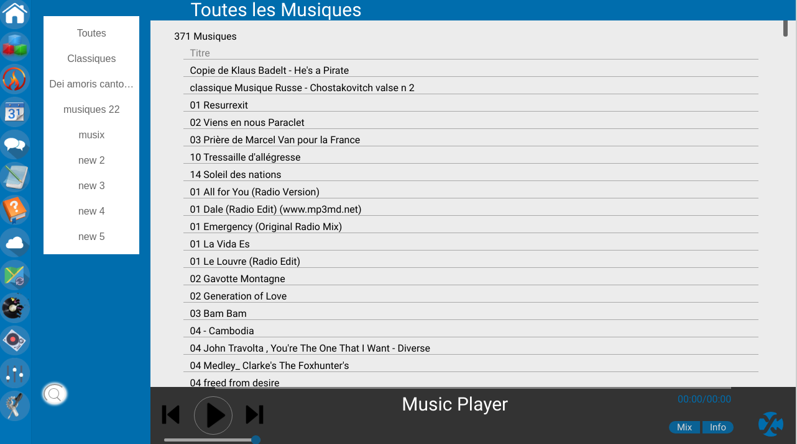

# Domotix web control interface

This project is part of the Aya project.
This is the web interface and web api (php, js, jquery, css, html)

  
  
  <em>AIA Project</em>

  
## Domotix is composed

* widgets for applications
* Agenda
* notepad
* control of the assistant
  * music control
  * devices control
  * heating management
  * alarm-clock control (not implemented)

* cloud storage control
  * pdf, video, music, html, txt,...
  * view and edit
  * upload and download
  * look the cloud project git
* music player
* dj player
* mindMap
* quote manager
* camera viewer
* user message application
* configuration interface

It is possible to simply add new pages and functionality

### Overview

  
  
  
  
  
  
  
  
  
  
  
  
  
  
  
  

### Add new pages and new widget

* copy your web app in "pages" folder
* add new page in setting page

* copy your web app in "modules" folder
* add new page in setting widget page

### python Backend

* sms notifications for events (only for free operator)
* log status
* auto save database

### Install

* read README.md in install folder
* init assistant connection and informations on setting page
* webdav install